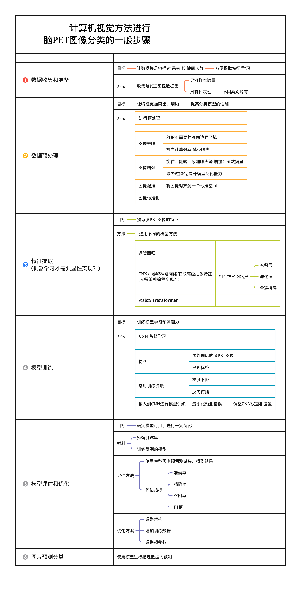
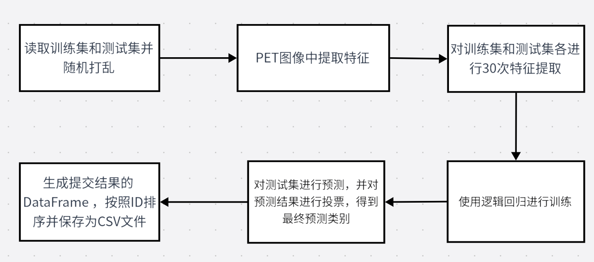
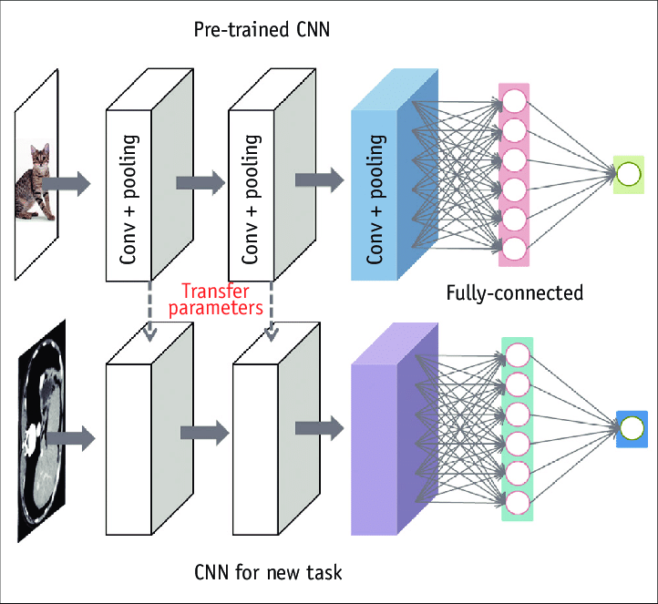
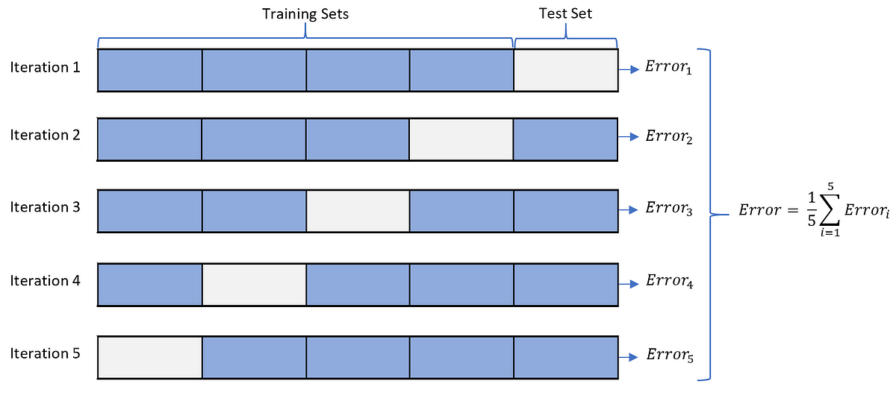
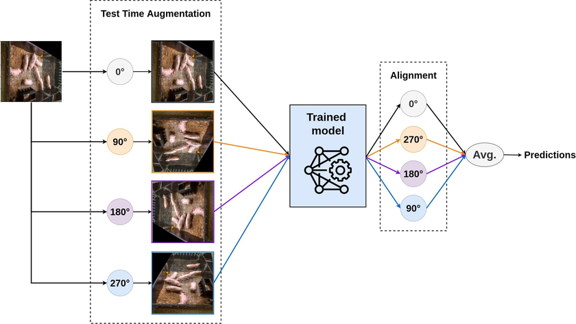
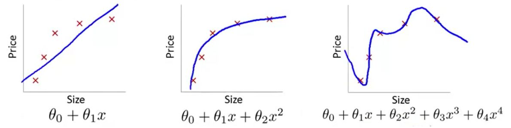
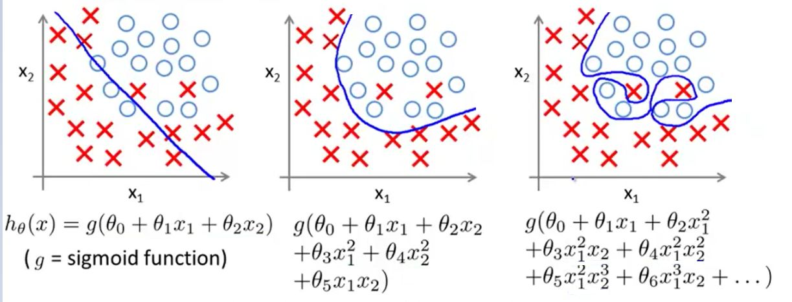

## 计算机视觉任务流程

例如



## 统计方法

- [ ] Baseline逐行精读：https://www.bilibili.com/video/BV1pm4y1L7H4

### 图像特征统计（传统方法）

图像特征统计是指对图像中的像素或图像区域进行统计分析，以提取和描述图像的特征信息。

1. 占比特征：通过统计图像中不同像素值或颜色通道的像素数量，计算其在整个图像中的比例或占比。
2. 边缘特征：边缘是图像中像素值或颜色发生剧烈变化的区域，通常表示物体的边界或纹理的边界。
3. 纹理特征：描述了图像中的纹理信息，反映了图像的细节和结构。

### 缺点

思路简单，不需要GPU就可以运行完成。

精度较差，且容易受到形态比较形似的影响。

### 代码



```Python
import glob                # 获取文件路径
import numpy as np
import pandas as pd
import nibabel as nib      # 处理医学图像数据
from nibabel.viewers import OrthoSlicer3D    # 图像可视化
from collections import Counter              # 计数统计

# 读取训练集文件路径
train_path = glob.glob('./脑PET图像分析和疾病预测挑战赛公开数据/Train/*/*')
test_path = glob.glob('./脑PET图像分析和疾病预测挑战赛公开数据/Test/*')

# 打乱训练集和测试集的顺序
np.random.shuffle(train_path)
np.random.shuffle(test_path)

# 对PET文件提取特征
def extract_feature(path):
    # 加载PET图像数据
    img = nib.load(path)
    # 获取第一个通道的数据
    img = img.dataobj[:, :, :, 0]
    
    # 随机筛选其中的10个通道提取特征
    random_img = img[:, :, np.random.choice(range(img.shape[2]), 10)]
    
    # 对图片计算统计值
    feat = [
        (random_img != 0).sum(),               # 非零像素的数量
        (random_img == 0).sum(),               # 零像素的数量
        random_img.mean(),                     # 平均值
        random_img.std(),                      # 标准差
        len(np.where(random_img.mean(0))[0]),  # 在列方向上平均值不为零的数量
        len(np.where(random_img.mean(1))[0]),  # 在行方向上平均值不为零的数量
        random_img.mean(0).max(),              # 列方向上的最大平均值
        random_img.mean(1).max()               # 行方向上的最大平均值
    ]
    
    # 根据路径判断样本类别（'NC'表示正常，'MCI'表示异常）
    if 'NC' in path:
        return feat + ['NC']
    else:
        return feat + ['MCI']

# 对训练集进行30次特征提取，每次提取后的特征以及类别（'NC'表示正常，'MCI'表示异常）被添加到train_feat列表中。
train_feat = []
for _ in range(30):
    for path in train_path:
        train_feat.append(extract_feature(path))
     
# 对测试集进行30次特征提取   
test_feat = []
for _ in range(30):
    for path in test_path:
        test_feat.append(extract_feature(path))
        
# 使用训练集的特征作为输入，训练集的类别作为输出，对逻辑回归模型进行训练。
from sklearn.linear_model import LogisticRegression
m = LogisticRegression(max_iter=1000)
m.fit(
    np.array(train_feat)[:, :-1].astype(np.float32),  # 特征
    np.array(train_feat)[:, -1]                       # 类别
)

# 对测试集进行预测并进行转置操作，使得每个样本有30次预测结果。
test_pred = m.predict(np.array(test_feat)[:, :-1].astype(np.float32))
test_pred = test_pred.reshape(30, -1).T

# 对每个样本的30次预测结果进行投票，选出最多的类别作为该样本的最终预测类别，存储在test_pred_label列表中。
test_pred_label = [Counter(x).most_common(1)[0][0] for x in test_pred]

# 生成提交结果的DataFrame，其中包括样本ID和预测类别。
submit = pd.DataFrame(
    {
        'uuid': [int(x.split('/')[-1][:-4]) for x in test_path],  # 提取测试集文件名中的ID
        'label': test_pred_label                                  # 预测的类别
    }
)

# 按照ID对结果排序并保存为CSV文件
submit = submit.sort_values(by='uuid')
submit.to_csv('submit1.csv', index=None)
```

## 深度学习方法

### CNN

- [ ] 视频讲解：https://www.bilibili.com/video/BV18h4y1V7as/

卷积神经网络（Convolutional Neural Network，CNN）是一种深度学习模型，广泛用于图像识别、计算机视觉和模式识别任务中。CNN 在处理具有网格结构数据（如图像）时表现出色，它能够自动学习和提取图像中的特征，并在分类、定位和分割等任务中取得优秀的性能。

**优缺点：**

- CNN带来的精度更好，但需要训练更长的时间
- CNN模型调优需要GPU

**Step1：自定义数据集**

```Python
import os, sys, glob, argparse
import pandas as pd
import numpy as np
from tqdm import tqdm

import cv2
from PIL import Image
from sklearn.model_selection import train_test_split, StratifiedKFold, KFold

import torch
# 用于设置随机数生成器的种子，若设置种子数为 0 ，表明每次运行代码时都会生成相同的随机数序列
torch.manual_seed(0)
# 用于控制是否使用确定性的卷积算法，若设置为 False ，使得每次运行代码时都会生成不同的随机数序列，从而使用不同的卷积结果
torch.backends.cudnn.deterministic = False    # 关闭确定性模式
# 用于控制是否使用CUDNN的自动调优功能，若设置为 True ，禁用CUDNN的自动调优功能，从而节省计算资源和时间
torch.backends.cudnn.benchmark = True    # 关闭自动调优

import torchvision.models as models
import torchvision.transforms as transforms
import torchvision.datasets as datasets
import torch.nn as nn
import torch.nn.functional as F
import torch.optim as optim
from torch.autograd import Variable
from torch.utils.data.dataset import Dataset

import nibabel as nib
from nibabel.viewers import OrthoSlicer3D

"""glob.glob()函数，用于查找文件目录和文件，并将搜索到的结果返回到一个列表中"""
# 训练集地址
train_path = glob.glob('./脑PET图像分析和疾病预测挑战赛公开数据/Train/*/*')
# 测试集地址
test_path = glob.glob('./脑PET图像分析和疾病预测挑战赛公开数据/Test/*')

"""np.random.shuffle()函数，用于将一个数组或列表中的元素随机打乱"""
# 打乱训练集
np.random.shuffle(train_path)
# 打乱测试集
np.random.shuffle(test_path)

# 定义一个 DATA_CACHE 的空的字典，用于缓存放置图片地址
DATA_CACHE = {}

# 定义 XunFeiDataset 类，用于处理图像数据集
class XunFeiDataset(Dataset):
    # __init__ 方法：初始化函数，接收两个参数。img_path：图像的路径列表；transform：可选图像转换操作（默认为 None）
    def __init__(self, img_path, transform=None):
        self.img_path = img_path
        if transform is not None:
            self.transform = transform
        else:
            self.transform = None
    
    # __getitem__ 方法：用于获取指定索引的图像和标签
    def __getitem__(self, index):
        # 如果缓存中存在该图像，则直接从缓存中获取（DATA_CACHE）
        if self.img_path[index] in DATA_CACHE:
            img = DATA_CACHE[self.img_path[index]]
        # 如果缓存中没有该图像，则使用 nib.load() 函数加载图像，并只保留第一个通道的数据
        else:
            img = nib.load(self.img_path[index])
            # img.dataobj 属性获取图像数据，数据包括图像的所有通道和时间序列信息，因此使用 [:,:,:,0] 来选择第一个通道的所有数据 
            img = img.dataobj[:,:,:, 0]
            DATA_CACHE[self.img_path[index]] = img
        
        # 从最后一个维度随机选择 50 个通道（0 ~ 通道数-1）            
        idx = np.random.choice(range(img.shape[-1]), 50)
        # 使用索引数组选取原始图像的所有通道，得到一个新的图像，其中包含这 50 个随机选择通道
        img = img[:, :, idx]
        # 将图像数据的数据类型转换为 32 位浮点数类型（为后续数值计算和梯度下降等操作提供方便）
        img = img.astype(np.float32)

        # 如果 self.transform 不为 None，则调用 self.transform 函数对图像 img 进行处理
        if self.transform is not None:
            img = self.transform(image = img)['image']
        
        # 对图像的维度进行转置【（C，H，W）-->（H，W，C）】
        img = img.transpose([2,0,1])
        # __getitem__ 方法返回一个元组，包含两个元素：处理后的图像数据和标签数据
        """torch.from_numpy(np.array(int('NC' in self.img_path[index])))
        首先，通过'NC' in self.img_path[index]判断当前图像文件名中是否包含字符串'NC'，如果包含则返回1，否则返回0。然后，将得到的数字转换为NumPy数组，再使用torch.from_numpy()方法将其转换为PyTorch张量类型"""
        return img,torch.from_numpy(np.array(int('NC' in self.img_path[index])))
    
    # __len__ 方法：用于获得图像路径列表的长度
    def __len__(self):
        return len(self.img_path)
        
import albumentations as A
# 对训练数据集进行数据预处理
train_loader = torch.utils.data.DataLoader(
    XunFeiDataset(
            train_path[:-10],    # 表示训练图像的路径（不包括最后10个字符）
            A.Compose([
            A.RandomRotate90(),    # 表示图形随机旋转 90 度
            A.RandomCrop(120, 120),    # 表示图像随机裁剪，裁剪后的图像大小为 120 × 120 像素
            A.HorizontalFlip(p=0.5),    # 表示图像以一定的概率水平翻转图像，翻转概率为 0.5
            A.RandomContrast(p=0.5),    # 表示图像随机改变对比度，调整对比度的概率为 0.5
            A.RandomBrightnessContrast(p=0.5),    # 表示图像随机改变亮度，调整亮度概率为 0.5
        ])
    ), batch_size=2,    # 表示每个批次包含 2 张图像【如果你的 GPU 很新，你可以设置的大一点】
       shuffle=True,     # 表示在每个训练周期开始时打乱数据顺序
       num_workers=1,     # 表示使用单个进程加载数据【本地验证时，可删除此操作】
       pin_memory=False    # 表示不将数据存储在 GPU 固定内存中【本地验证时，可删除此操作】
)

# 对验证数据集进行数据预处理
val_loader = torch.utils.data.DataLoader(
    XunFeiDataset(train_path[-10:],
            A.Compose([
            A.RandomCrop(120, 120),
        ])
    ), batch_size=2, shuffle=False, num_workers=1, pin_memory=False
)

# 对测试数据集进行数据预处理
test_loader = torch.utils.data.DataLoader(
    XunFeiDataset(test_path,
            A.Compose([
            A.RandomCrop(128, 128),
            A.HorizontalFlip(p=0.5),    # 表示图像随机垂直翻转，翻转比例为 0.5
            A.RandomContrast(p=0.5),
        ])
    ), batch_size=2, shuffle=False, num_workers=1, pin_memory=False
)
```

**Step2：自定义CNN模型**

```Python
# 定义 XunFeiNet 类，用于存放模型相关参数
class XunFeiNet(nn.Module):
    def __init__(self):
        super(XunFeiNet, self).__init__()
        
        # 创建 ResNet-18 模型，并赋值给 model 变量        
        model = models.resnet18(True)
        # 将 ResNet-18 模型的初始卷积层替换为新的卷积层，新卷积层输入通道数为 50，输出通道数为 64，卷积核大小为 7 × 7，步长为 2 × 2，填充大小为 3 × 3，不使用偏执项
        model.conv1 = torch.nn.Conv2d(50, 64, kernel_size=(7, 7), stride=(2, 2), padding=(3, 3), bias=False)
        # 将 ResNet-18 模型的平均池化层替换为一个自适应平均池化层，池化窗口大小为 1 × 1
        model.avgpool = nn.AdaptiveAvgPool2d(1)
        # 将 ResNet-18 模型的全连接层替换为一个新的线性层，新的线性层输入维度为 512，输出维度为 2
        model.fc = nn.Linear(512, 2)
        # 将修改后的 ResNet-18 模型赋值给变量 self.resnet
        self.resnet = model
    
    # 定义前向传递函数，将输入的图像 img 传递给修改后的 ResNet-18 模型，得到输出结果 out，并将其作为函数的返回值    
    def forward(self, img):        
        out = self.resnet(img)
        return out

# 模型选择 XunFeiNet() 模型        
model = XunFeiNet()
# 将模型部署到 GPU 上
model = model.to('cuda')
# 损失函数使用交叉熵损失函数（Cross Entropy Loss），并部署到 GPU 上
criterion = nn.CrossEntropyLoss().cuda()
# 优化器使用 AdamW 算法，优化器将通过最小化模型参数的 L2 范数来更新模型参数，学习率设置为 0.001
optimizer = torch.optim.AdamW(model.parameters(), 0.001)
```

- [ ] [损失函数（Loss Function）](https://zhuanlan.zhihu.com/p/261059231)
- [ ] [优化器(Optimizer)](https://zhuanlan.zhihu.com/p/261695487)
- [ ] [残差神经网络（ResNet）](https://zhuanlan.zhihu.com/p/101332297)
- [ ] [深度学习入门-卷积神经网络（一）卷积层](https://zhuanlan.zhihu.com/p/259751387)
- [ ] [深度学习入门-卷积神经网络（二）池化层](https://zhuanlan.zhihu.com/p/259797994)

**Step3：模型训练与验证**

```Python
# 定义训练函数
def train(train_loader, model, criterion, optimizer):
"""
    Parameter（输入参数）
    train_loader: 训练集，用于按批次提供训练数据
    model: 训练时使用的模型
    criterion: 训练时使用的损失函数，用于计算模型输出和目标之间的损失
    optimizer: 训练时使用的优化器，用于更新模型参数以最小化损失
    
    Return
    train_loss/len(train_loader): 平均训练损失
"""
    # 将模型设置为训练模式 
    model.train()
    # 初始化训练损失为 0.0
    train_loss = 0.0
    # 使用 for 循环遍历训练集中的每一个批次
    for i, (input, target) in enumerate(train_loader):
        # 输入数据部署到 GPU 上【确认可以使用 GPU 进行运算时，删除 non_blocking=True 属性】
        input = input.cuda(non_blocking=True)
        # 目标数据部署到 GPU 上【确认可以使用 GPU 进行运算时，删除 non_blocking=True 属性】
        target = target.cuda(non_blocking=True)

        # 调用模型生成基于此模型的输出
        output = model(input)
        # 使用损失函数计算输出和目标之前的损失
        loss = criterion(output, target.long())

        # 在计算损失之前，调用优化器的 zero_grad() 函数将梯度清零
        optimizer.zero_grad()
        # 调用损失对象的 backward() 方法计算损失相对于模型参数的梯度
        loss.backward()
        # 调用优化器的 step() 函数更新模型参数
        optimizer.step()

        # 每 20 个批次进行一次损失值的打印输出
        if i % 20 == 0:
            print(loss.item())
        
        # 将当前批次的损失值累加到总的损失值中
        train_loss += loss.item()
    
    return train_loss/len(train_loader) # 所有批次结束后返回平均训练损失

# 定义验证函数            
def validate(val_loader, model, criterion):
"""
    Parameter（输入参数）
    val_loader: 验证集，用于按批次提供验证数据
    model: 验证时使用的模型
    criterion: 验证时使用的损失函数，用于计算模型输出和目标之间的损失

    Return
    val_acc / len(val_loader.dataset): 平均验证准确率
"""
    # 将模型设置为验证模式
    model.eval()
    # 初始化验证准确率为 0.0
    val_acc = 0.0
    
    # 使用 torch.no_grad() 上下文管理器禁用梯度计算，以减少内存消耗并提高计算速度
    with torch.no_grad():
        # 使用 for 循环遍历验证集中的每一个批次
        for i, (input, target) in enumerate(val_loader):
            # 将输入数据部署到 GPU 上
            input = input.cuda()
            # 将目标数据部署到 GPU 上
            target = target.cuda()

            # 调用模型生成基于此模型的输出
            output = model(input)
            # 使用损失函数计算输出和目标之间的损失
            loss = criterion(output, target.long())
            
            # 计算模型预测的类别与目标类别是否相等，并将匹配的数量累加到验证准确率中
            val_acc += (output.argmax(1) == target).sum().item()
            
    return val_acc / len(val_loader.dataset)    # 所有批次结束后得到平均验证准确率
    
# 循环训练【循环次数为 3 次】
for _  in range(3):
    # 调用 train() 函数，使用训练集、模型、损失函数和优化器进行训练，并返回当前批次的训练损失
    train_loss = train(train_loader, model, criterion, optimizer)
    # 调用 validate() 函数，使用验证集、模型、损失函数进行验证，并返回当前批次的验证准确率
    val_acc  = validate(val_loader, model, criterion)
    # 调用 validate() 函数，使用训练集、模型、损失函数进行测试，并返回当前批次的训练准确率
    train_acc = validate(train_loader, model, criterion)
    
    # 打印输出训练损失（train_loss），训练准确率（train_acc）, 验证准确率（val_acc）
    print(f'第{_ + 1}轮：训练损失：{train_loss}, 训练准确率：{train_acc}, 验证准确率：{val_acc}')
```

> 适当增加训练轮数可以提高结果

**Step4：模型预测与提交**

```Python
# 定于预测函数，用于对测试数据进行预测
def predict(test_loader, model, criterion):
"""
    Parameter（输入参数）
    test_loader: 测试集，用于按批次提供测试数据
    model: 测试时使用的模型
    criterion: 测试时使用的损失函数，用于计算模型输出和目标之间的损失
    
    Return
    np.vstack(test_pred):垂直堆叠的 Numpy 数组
"""
    # 将模型设置为验证模式
    model.eval()
    # 初始化验证准确率为 0.0
    val_acc = 0.0
    
    # 创建一个 test_pred 空列表，用于存放每个测试样本的预测结果
    test_pred = []
    # 使用 torch.no_grad() 上下文管理器禁用梯度计算，以减少内存消耗并提高计算速度
    with torch.no_grad():
        # 使用 for 循环遍历测试集中的每一个批次
        for i, (input, target) in enumerate(test_loader):
            # 将输入数据部署到 GPU 上
            input = input.cuda()
            # 将目标数据部署到 GPU 上
            target = target.cuda()

            # 调用模型生成基于次模型的输出
            output = model(input)
            # 将输出数据转换为 Numpy 数组，并将其添加到 test_pred 列表中
            test_pred.append(output.data.cpu().numpy())
            
    return np.vstack(test_pred)
    
# 初始化 perd 为 None（空值）
pred = None

# 使用 for 循环来预测测试数据集中的图像【循环 10 次】
for _ in range(10):
    # 如果 pred 为 None，则调用 predict 函数来预测测试数据集中的所有图像，并将结果赋值给 pred
    if pred is None:
        pred = predict(test_loader, model, criterion)
   # 如果 pred 不为 None，则将当前批次的预测结果与之前批次的预测结果相加，并将结果赋值给 pred
    else:
        pred += predict(test_loader, model, criterion)
        
# 创建名为 submit 的 Pandas DataFrame 对象
submit = pd.DataFrame(
    {
        # 从 test_path 中提取的 uuid
        # 使用 split('/') 方法将路径拆分成多个部分，然后取最后一个部分（即文件名），并使用切片操作 [:-4] 去掉文件名中的后缀部分。最后，将结果转换为整数类型
        'uuid': [int(x.split('\\')[-1][:-4]) for x in test_path],
        # 从 pred 数组中每行的最大值所对应的索引
        # 使用 argmax（1） 方法获取最大值对应的索引
        'label': pred.argmax(1)
})
# 将 submit DataFrame 中的 label 列的值从整数类型转换为字符串类型。
# 将值为 1 的位置映射为字符串 'NC' ，将值为 0 的位置映射为字符串 'MCI'
submit['label'] = submit['label'].map({1:'NC', 0: 'MCI'})
# 按照uuid列的值对 submit DataFrame 进行排序（按照升序的顺序排列所有行）
submit = submit.sort_values(by='uuid')
# 将 submit DataFrame 保存为一个名为 submit2.csv 的 CSV 文件。index=None 参数表示不将索引列写入 CSV 文件中
submit.to_csv('submit2.csv', index=None)    # 可以修改保存位置 './path/submit2.csv'
```

### 预训练模型

ResNet（Residual Network）是一个非常重要的深度学习架构，它在2015年由Kaiming He等人提出，并在ImageNet图像分类竞赛中获得了优异的成绩。ResNet解决了深度神经网络中出现的梯度消失和梯度爆炸等问题，使得训练非常深的神经网络变得可能。

 

在之前的代码中，包含了一些细节：

- 使用PyTorch内置的 `models.resnet18(True)` 载入预训练的ResNet-18模型。`True` 参数表示加载预训练的权重。
- 修改 `model.conv1`：对ResNet-18的第一个卷积层进行了修改，将输入通道数从3改为50。这可能是针对特定问题或数据集的定制。
- 修改 `model.avgpool`：替换原有的平均池化层为自适应平均池化层，这允许不同大小的输入图像得到相同尺寸的输出特征。
- 修改 `model.fc`：替换ResNet的全连接分类层，将输出类别数从原来的1000改为2，以适应特定的二分类任务。

```Python
class XunFeiNet(nn.Module):
    def __init__(self):
        super(XunFeiNet, self).__init__()
                
        model = models.resnet18(True)
        model.conv1 = torch.nn.Conv2d(50, 64, kernel_size=(7, 7), stride=(2, 2), padding=(3, 3), bias=False)
        model.avgpool = nn.AdaptiveAvgPool2d(1)
        model.fc = nn.Linear(512, 2)
        self.resnet = model
        
    def forward(self, img):        
        out = self.resnet(img)
        return out
```

在torchvison中内置了很多预训练模型：https://pytorch.org/vision/stable/models.html#classification

在参赛的过程中，可以自由选择。但选择的过程需要考虑到模型的复杂度，也需要考虑到自身的显存大小。

```Python
from torchvision.models import resnet50
model = resnet50(True)
```

### 数据增强

- [ ] [Albumentations数据增强方法_shiftscalerotate_愤怒的勇的博客-CSDN博客](https://blog.csdn.net/qq_27039891/article/details/100795846)

数据增强是在训练深度学习模型时常用的一种技术，通过对原始数据进行各种变换和扩充，生成更多、更多样化的训练样本，从而提升模型的性能和泛化能力。数据增强的目标是增加模型对不同变化、角度和噪声的鲁棒性，使其更好地应对现实世界中的各种情况。

以下是一些常见的数据增强技术：

1. 随机翻转（Random Flip）：对图像进行水平或垂直方向的翻转，以扩充数据集。对于图像分类等任务，通常使用水平翻转，而对于语义分割等任务，垂直翻转也可能有用。
2. 随机旋转（Random Rotation）：对图像进行随机角度的旋转，增加模型对旋转变换的适应能力。
3. 随机裁剪（Random Crop）：在图像中随机选取一个区域作为新的样本，这可以帮助模型学习对不同尺寸和位置的物体的识别。
4. 颜色变换（Color Jittering）：调整图像的亮度、对比度、饱和度和色调，以模拟不同光照条件下的图像。
5. 添加噪声（Adding Noise）：在图像中添加随机噪声，例如高斯噪声，以提高模型对噪声的鲁棒性。
6. 缩放和尺度变换（Scale and Size Augmentation）：调整图像的尺寸，使模型能够处理不同大小的物体。
7. 透视变换（Perspective Transformation）：对图像进行透视变换，模拟不同视角下的图像。
8. 随机遮挡（Random Occlusion）：在图像中随机添加遮挡物，以让模型学习处理部分信息丢失的情况。
9. 自适应平均池化（Adaptive Average Pooling）：将不同大小的输入图像转换为相同大小，有助于模型处理变化的图像尺寸。
10. 混合数据（Mixup and CutMix）：将不同样本的特征进行混合，生成新的样本，以增加数据集的多样性。


Albumentations是一个用于图像数据增强的开源Python库，旨在为深度学习项目提供灵活且高效的数据增强工具。它提供了许多各种各样的图像增强操作，可以应用于图像分类、目标检测、语义分割等不同的任务。

- [ ] https://albumentations.ai/docs/getting_started/image_augmentation/


- [ ] https://demo.albumentations.ai/


下面的代码展示了如何使用PyTorch的 `DataLoader` 结合 `albumentations` 库进行数据加载和增强。这主要用于训练深度学习模型时，对训练数据进行批量加载和数据增强操作。

```Python
import albumentations as A
train_loader = torch.utils.data.DataLoader(
    XunFeiDataset(train_path[:-10],
            A.Compose([
            A.RandomRotate90(),
            A.RandomCrop(120, 120),
            A.HorizontalFlip(p=0.5),
            A.RandomContrast(p=0.5),
            A.RandomBrightnessContrast(p=0.5),
        ])
    ), batch_size=2, shuffle=True, num_workers=1, pin_memory=False
)
```

### 模型交叉验证

交叉验证（Cross-Validation，简称CV）是一种在机器学习中用于评估模型性能和选择参数的技术，是[划分验证集](划分验证集.md)的一种方法。它的目标是充分利用有限的数据，减少因数据分布不均匀或随机性带来的评估误差。交叉验证将数据分成多个子集（折叠），然后多次训练和测试模型，以获取更准确的性能评估。



在原始的代码中使用了最后10个样本作为验证集：

```Python
train_loader = torch.utils.data.DataLoader(
    XunFeiDataset(train_path[:-10],
    ...
)

val_loader = torch.utils.data.DataLoader(
    XunFeiDataset(train_path[-10:],
    ...
)
```

如下使用交叉验证，伪代码逻辑如下：

```Python
from sklearn.model_selection import train_test_split, StratifiedKFold, KFold
skf = KFold(n_splits=10, random_state=233, shuffle=True)

for fold_idx, (train_idx, val_idx) in enumerate(skf.split(train_path, train_path)):

    train_loader = torch.utils.data.DataLoader(
        XunFeiDataset(train_path[train_idx],
        ...
    )
    
    val_loader = torch.utils.data.DataLoader(
        XunFeiDataset(train_path[val_idx],
        ...
    )
    
    model = XunFeiNet()
    model = model.to('cuda')
    criterion = nn.CrossEntropyLoss().cuda()
    optimizer = torch.optim.AdamW(model.parameters(), 0.001)
    
    for _  in range(3):
        train_loss = train(train_loader, model, criterion, optimizer)
        val_acc  = validate(val_loader, model, criterion)
        train_acc = validate(train_loader, model, criterion)
        
        print(train_loss, train_acc, val_acc)
        torch.save(model.state_dict(), './resnet18_fold{0}.pt'.format(fold_idx))
```

### 测试集增强

测试集增强（Test-time Augmentation，简称TTA）是一种在模型推理阶段（测试阶段）应用数据增强技术的方法。通常，在模型训练阶段使用数据增强是为了提升模型的鲁棒性和泛化能力，但是在真实应用中，对于单个样本的预测，模型可能会因为不同的变换产生不同的预测结果。为了减少这种不确定性，可以在预测时对同一个样本应用多种不同的数据增强方式，然后将预测结果进行集成，最终得到一个更稳定的预测。



如下伪代码是结合了多折和测试集数据增强：

```Python
pred = None

for model_path in ['resnet18_fold0.pt', 'resnet18_fold1.pt', 'resnet18_fold2.pt',
                  'resnet18_fold3.pt', 'resnet18_fold4.pt', 'resnet18_fold5.pt',
                  'resnet18_fold6.pt', 'resnet18_fold7.pt', 'resnet18_fold8.pt',
                  'resnet18_fold9.pt']:
         
    model = XunFeiNet()
    model = model.to('cuda')
    model.load_state_dict(torch.load(model_path))
    
    for _ in range(10):
        if pred is None:
            pred = predict(test_loader, model, criterion)
        else:
            pred += predict(test_loader, model, criterion)
```

## 评价指标

### 过拟合





### F1_score

- [ ] [混淆矩阵、F1score详解_一起努力啊～的博客-CSDN博客](https://blog.csdn.net/m0_68165821/article/details/132261322)

### 精准率 召回率 F1

- [ ] [直观理解常用分类指标：精准率 召回率 F1_哔哩哔哩_bilibili](https://www.bilibili.com/video/BV1Rc411c7US/?spm_id_from=888.80997.embed_other.whitelist&vd_source=2fd7a12ad944b39c2263c1c7342c4723)

- [ ] [直观理解常用的分类评价指标 (wolai.com)](https://www.wolai.com/stupidccl/kdRW2EwWtJ4qN3MnTjgKCR)

### 混淆矩阵

- [ ] [混淆矩阵、F1score详解_一起努力啊～的博客-CSDN博客](https://blog.csdn.net/m0_68165821/article/details/132261322)

## 参考资料

- [ ] [AI夏令营第三期 - 脑PET图像分析和疾病预测挑战赛教程 ](https://datawhaler.feishu.cn/docx/K6RndJlW5ocYfZxJ02ucGIwmnqd)
- [ ] [‌‬‍⁣‬​⁡⁣‬⁣⁢⁢‍⁣⁤​​⁤​⁢⁤‬‌​‬‌⁢⁤⁣⁣​‌​‍‍⁤‌⁢⁢‌⁣脑PET图像分析和疾病预测挑战赛【手撕CNN版】 - 飞书云文档 (feishu.cn)](https://n10kamuuf4d.feishu.cn/docx/KFWxdFqKBoAMurxAP1McTin4nie)

