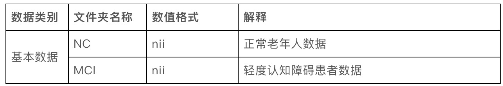

# 赛题解析

**脑PET图像分析和疾病预测挑战赛**

https://challenge.xfyun.cn/topic/info?type=pet-2023&ch=ymfk4uU

## **赛题背景**

脑PET全称为脑部正电子发射计算机断层显像(brain positron emission tomography PET)，是反映脑部病变的基因、分子、代谢及功能状态的显像。它是利用正电子核素标记葡萄糖等人体代谢物作为显像剂，通过病灶对显像剂的摄取来反映其代谢变化，从而为临床提供疾病的生物代谢信息，为脑癫痫病、脑肿瘤、帕金森病、阿尔茨海默综合征等提供了有效的检测手段。可利用脑PET图像检测出轻度认知障碍病灶，并提前介入治疗，从而延缓发病，对后续患者康复治疗有着积极的意义。因此本赛题以轻度认知障碍为例对脑PET图像进行分析与疾病预测。

## **赛事任务**

为研究基于脑PET图像的疾病预测，本次大赛提供了海量脑PET数据集作为脑PET图像检测数据库的训练样本，参赛者需根据提供的样本构建模型，对轻度认知障碍进行分析和预测。

脑PET图像检测数据库，记录了老年人受试志愿者的脑PET影像资料，其中包括确诊为轻度认知障碍（MCI）患者的脑部影像数据和健康人（NC）的脑部影像数据。

被试者按医学诊断分为两类：

NC：健康

MCI：轻度认知障碍

## **赛题数据集**

本次大赛所用脑PET图像检测数据库，图像格式为nii。

## 详细介绍

进入[CV](CV.md)