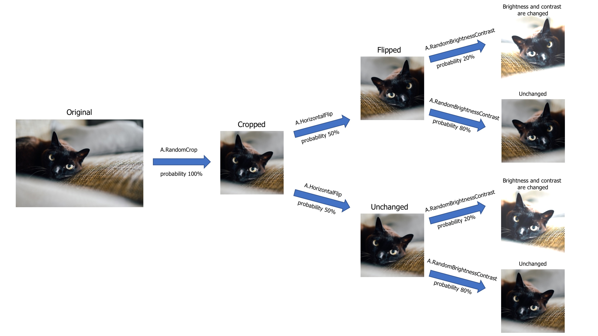

- [ ] [Albumentations数据增强方法_shiftscalerotate_愤怒的勇的博客-CSDN博客](https://blog.csdn.net/qq_27039891/article/details/100795846)

数据增强是在训练深度学习模型时常用的一种技术，通过对原始数据进行各种变换和扩充，生成更多、更多样化的训练样本，从而提升模型的性能和泛化能力。数据增强的目标是增加模型对不同变化、角度和噪声的鲁棒性，使其更好地应对现实世界中的各种情况。

以下是一些常见的数据增强技术：

1. 随机翻转（Random Flip）：对图像进行水平或垂直方向的翻转，以扩充数据集。对于图像分类等任务，通常使用水平翻转，而对于语义分割等任务，垂直翻转也可能有用。
2. 随机旋转（Random Rotation）：对图像进行随机角度的旋转，增加模型对旋转变换的适应能力。
3. 随机裁剪（Random Crop）：在图像中随机选取一个区域作为新的样本，这可以帮助模型学习对不同尺寸和位置的物体的识别。
4. 颜色变换（Color Jittering）：调整图像的亮度、对比度、饱和度和色调，以模拟不同光照条件下的图像。
5. 添加噪声（Adding Noise）：在图像中添加随机噪声，例如高斯噪声，以提高模型对噪声的鲁棒性。
6. 缩放和尺度变换（Scale and Size Augmentation）：调整图像的尺寸，使模型能够处理不同大小的物体。
7. 透视变换（Perspective Transformation）：对图像进行透视变换，模拟不同视角下的图像。
8. 随机遮挡（Random Occlusion）：在图像中随机添加遮挡物，以让模型学习处理部分信息丢失的情况。
9. 自适应平均池化（Adaptive Average Pooling）：将不同大小的输入图像转换为相同大小，有助于模型处理变化的图像尺寸。
10. 混合数据（Mixup and CutMix）：将不同样本的特征进行混合，生成新的样本，以增加数据集的多样性。



Albumentations是一个用于图像数据增强的开源Python库，旨在为深度学习项目提供灵活且高效的数据增强工具。它提供了许多各种各样的图像增强操作，可以应用于图像分类、目标检测、语义分割等不同的任务。

- [ ] https://albumentations.ai/docs/getting_started/image_augmentation/


- [ ] https://demo.albumentations.ai/


下面的代码展示了如何使用PyTorch的 `DataLoader` 结合 `albumentations` 库进行数据加载和增强。这主要用于训练深度学习模型时，对训练数据进行批量加载和数据增强操作。

```Python
import albumentations as A
train_loader = torch.utils.data.DataLoader(
    XunFeiDataset(train_path[:-10],
            A.Compose([
            A.RandomRotate90(),
            A.RandomCrop(120, 120),
            A.HorizontalFlip(p=0.5),
            A.RandomContrast(p=0.5),
            A.RandomBrightnessContrast(p=0.5),
        ])
    ), batch_size=2, shuffle=True, num_workers=1, pin_memory=False
)
```
